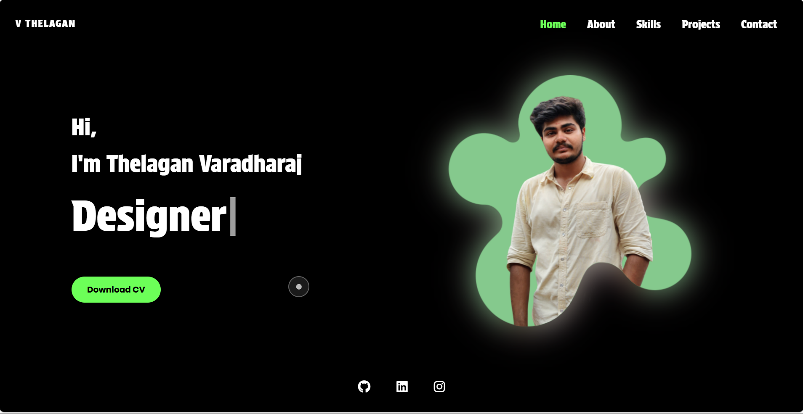

# Personal Portfolio Website - Thelagan Varadharaj

This repository contains the source code for my personal portfolio website, meticulously designed and coded to showcase my skills, projects, and professional journey in the world of technology.

### [➡️ View Live Demo ⬅️](https://thelaganvaradharaj.github.io/official)

---

### Screenshot



*(**Action Required:** Add a screenshot of your project to an `images` folder and update the path above. A good name is `screenshot.png` or `demo.gif`)*

## 📜 About The Project

This portfolio is more than just a resume; it's a dynamic and interactive presentation of my capabilities as an innovator, designer, and developer. I wanted to create a modern, responsive, and engaging user experience that reflects my passion for clean design and cutting-edge technology. The website is structured into several key sections: Home, About Me, Skills, Projects, and a functional Contact form.

## ✨ Features

- **Interactive Homepage:** A `Typed.js` animation introduces my professional roles, complemented by a custom animated cursor and a glowing profile image effect.
- **Engaging 'About Me' Page:** Features a subtle parallax effect on the profile image and an animated RGB gradient for key text, adding a touch of dynamism.
- **Dynamic Skills Showcase:** Utilizes infinite scrolling marquees to display both technical and non-technical skills, complete with logos for immediate visual recognition.
- **Project Carousel:** An auto-scrolling horizontal carousel on desktop (which pauses on hover) and a touch-friendly swipe/drag interface on mobile.
- **Functional Contact Form:** Integrated with **EmailJS** to send messages directly to my inbox without requiring a backend server.
- **Fully Responsive Design:** A mobile-first approach ensures a seamless experience across all devices, from desktops to smartphones, featuring a custom hamburger menu for navigation.
- **Custom Cursor:** A unique dot-and-outline cursor for desktop users that provides visual feedback when interacting with links and clickable elements.

## 🛠️ Tech Stack & Tools

- **Frontend:**
  - HTML5
  - CSS3
  - JavaScript (ES6)
- **Libraries:**
  - [Typed.js](https://github.com/mattboldt/typed.js/)
  - [Font Awesome](https://fontawesome.com/)
  - [EmailJS](https://www.emailjs.com/)
- **Design:**
  - Figma
- **Development Assistance:**
  - Gemini AI
- **Deployment:**
  - GitHub Pages

## 🎨 Design & Development Process

The creation of this portfolio was a comprehensive process that combined structured design with modern development techniques.

1.  **Design in Figma:** The entire user interface and experience were first designed in **Figma**. This crucial first step allowed me to establish a cohesive visual identity, experiment with layouts, define the color palette, and prototype the user flow before writing a single line of code.

2.  **AI-Assisted Development:** To accelerate the development process, I utilized **Gemini AI** as a coding assistant. It was instrumental in generating boilerplate code, exploring different implementation approaches for complex animations, and quickly drafting the initial structure of the HTML and CSS.

3.  **Debugging and Refinement:** Using AI was a starting point, not the final step. The process involved significant **debugging, custom modifications, and manual refinement** to ensure the final product was not only functional but also perfectly aligned with my original Figma designs. I dedicated considerable time to resolving cross-browser compatibility issues, optimizing animations for performance, and perfecting the responsive layout. This hands-on approach was crucial in transforming the generated code into a polished, professional, and personal final product.

## 🚀 Getting Started

To get a local copy up and running, follow these simple steps.

### Prerequisites

You only need a modern web browser.

### Installation

1.  Clone the repository to your local machine:
    ```sh
    git clone [https://github.com/thelaganvaradharaj/your-repo-name.git](https://github.com/thelaganvaradharaj/official.git)
    ```
2.  Navigate to the project directory:
    ```sh
    cd official
    ```
3.  Open the `index.html` file in your preferred browser.

The website is built with vanilla technologies and requires no complex build steps to view. The contact form functionality is tied to my specific EmailJS keys and will not work offline without your own setup.

## 📫 Contact

Thelagan Varadharaj - [LinkedIn](https://www.linkedin.com/in/thelagan-varadharaj/) - vthelagan.act2023@citchennai.net

Project Link: [https://github.com/thelaganvaradharaj/official](https://github.com/thelaganvaradharaj/official)

## 📄 License

This project is licensed under the MIT License - see the `LICENSE` file for details.
